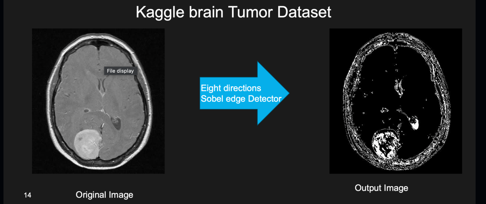

# 🧠 Eight Direction Sobel Edge Detector for Brain Tumor Detection

**Author**: Edouard David  
**Project**: MRI Image Processing – Brain Tumor Detection

---

## 📄 Overview

This project implements the methodology described in the paper:  
**"Comparative Analysis of Eight Direction Sobel Edge Detection Algorithm for Brain Tumor MRI Images"**  
The algorithm enhances traditional edge detection by applying **Sobel operators in 8 directions**, improving accuracy in identifying tumor regions in MRI scans.

---

## 🔍 Pipeline Summary

### 🔬 Article’s Pipeline (Sorbonne Université):

1. MRI Data Acquisition  
2. Image Pre-processing  
3. Image Filtering *(Noise Removal)*  
4. Edge Detection  

> *Noise Removal: Helps eliminate redundant pixel information and improves analysis.*

### 🛠 Project Implementation Pipeline:

1. **Gather Data** (Kaggle MRI Dataset)  
2. **Create Output Folder**  
3. **Loop Over Each Image**  
4. **Gaussian Filter** (for noise removal)  
5. **8-Direction Sobel Edge Detection**  
6. **Compute Gradient Norm**  
7. **Thresholding & Save Output**

---

## 🧪 Sample Results

Comparison between an original MRI brain image and the processed output:

 
<i>Left: Original Image — Right: Output Image with 8-Direction Sobel</i>

---

## 💡 Core Techniques

- **Gaussian Blurring** – Noise reduction using a 3×3 kernel with σ = 1  
- **Sobel Edge Detection** – 8 unique kernels convolved with each image  
- **Gradient Norm Computation** – Combines directional gradients  
- **Thresholding** – Emphasizes tumor boundaries  

---
## 📚 References
Remya Ajai A Sa (2022). Comparative Analysis of Eight Direction Sobel Edge Detection Algorithm for Brain Tumor MRI Images, ScienceDirect.
Brain Tumor MRI Dataset (Kaggle)
